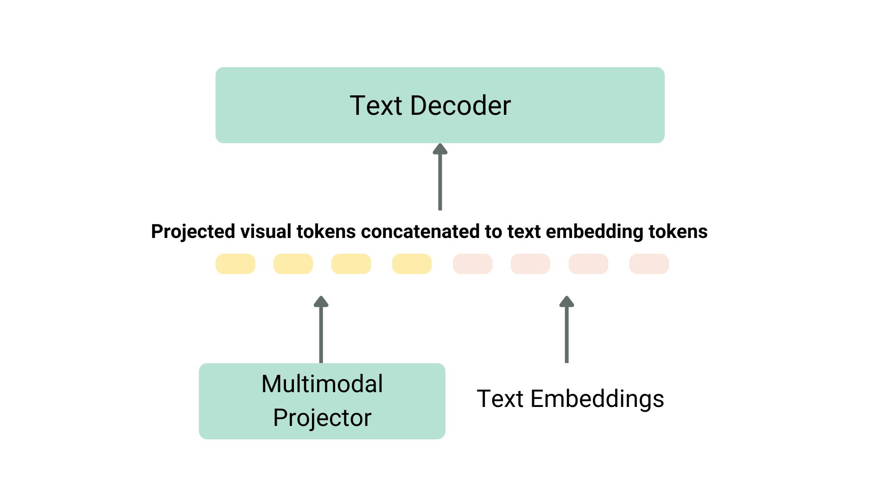

# VLM-UI-Element-Locator
## 1. Project overview
This project demonstrates how a Vision Language Model (VLM) can be used to understand and interact with graphical user interfaces (GUIs). The primary goal is to take a screenshot of a website or application and locate the precise coordinates of a specific UI element based on a user's natural language description.

Here is the workflow:
  - **Input**: The user provides an image of a UI (e.g., a website screenshot).
  - **Query**: The user describes the target element they want to find, such as `"the blue login button"` or `"the search bar."`
  - **Output**: The model processes both the image and the text query, returning the exact (x, y) coordinates for the center of that element.
 ```mermaid
flowchart LR
    A([Start]) --> B[Survey Image with VLM to Create UI Map]
    B --> C[/Input: UI Element/]
    C --> D{"Input is 'quit' or 'exit'?"}
    D -- Yes --> Z([End])
    D -- No --> E{"Element Found in Map?"}
    E -- Yes --> F[Calculate & Display Click Coordinates]
    E -- No --> H[Display 'Not Found' Message]
    F -.-> C
    H -.-> C
```
## 2. What I've learned 
  ### How a VLM Model Works
  Before this project, I only had experience with traditional computer vision models like YOLOv9. Through this work, I generally learned how a VLM uses both an image encoder and a text encoder to create a shared feature space. This allows the model to not only “see” but also “read,” and then respond based on the combination of both inputs.
  
  ### Reading documentation
  I gained hands-on experience reading Hugging Face model cards and official GitHub repositories to better understand how models are trained. From their examples, I was able to adapt and modify the code to build my own solution. This process improved my ability to research and apply open-source resources effectively.
  ### Prompt Engineering: 
 While implementing the project, I noticed that the same prompt could sometimes lead to different outputs. I also realized that the more detailed my prompt was, the better the response became. This taught me how crucial prompt design is for model performance.
 
In order to make the model return coordinates in a consistent format, I provided multiple examples and explicitly instructed the model not to include any extra explanations.
## 3. My project limitation
This project I use MiniCPM-V 4.5, a model that just came out in August 2025. It's a big step up from older versions miniCPMv2.6, but since it's a general-purpose model, it's not perfectly tuned for this specific UI task. I'm pretty sure that with some custom fine-tuning, the model could become incredibly accurate for this kind of work.

One of the main challenges I encountered was bounding box precision. Although the model can successfully identify the correct element in many cases, the bounding box does not always align properly with the target.
```
# Model result
Survey complete! Found 8 elements.
[('The Facebook logo in blue text', '40 200 270 330'), ('Text stating "Facebook helps you connect and share with the people in your life."', '40 360 480 470'), ('A text input field labeled "Email address or phone number"', '560 120 920 200'), ('A text input field labeled "Password"', '560 260 920 340'), ('A blue "Log in" button', '560 360 920 460'), ('A link stating "Forgotten password?"', '650 490 790 530'), ('A green "Create new account" button', '560 620 920 720'), ('Text stating "Create a Page for a celebrity, brand or business."', '580 830 890 870')] 
```

Even though I instructed the model to output coordinates in a strict format and provided multiple prompt examples, the bounding box was sometimes shifted or incorrectly sized. This shows that while VLMs are strong at semantic understanding, additional work is needed for spatial accuracy when applying them to UI tasks.
### 4. References
[1] OpenBMB, *MiniCPM-V4.5 Repository*. Available at: https://github.com/OpenBMB/MiniCPM-V  

[2] Hugging Face, *Vision Language Models Explained*. Available at: https://huggingface.co/blog/vlm
